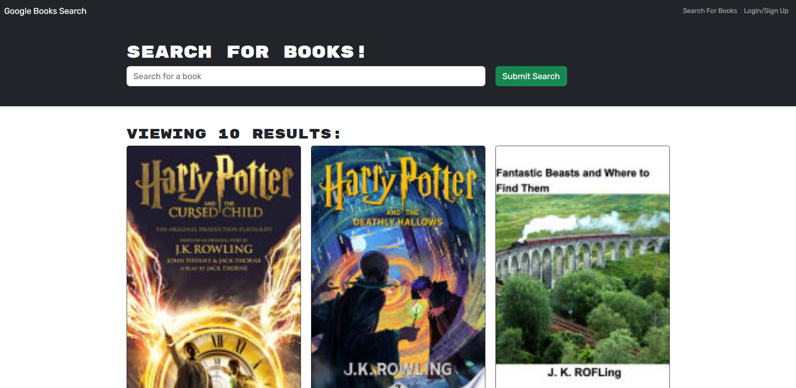
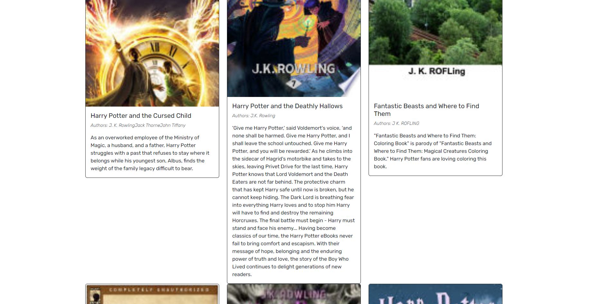
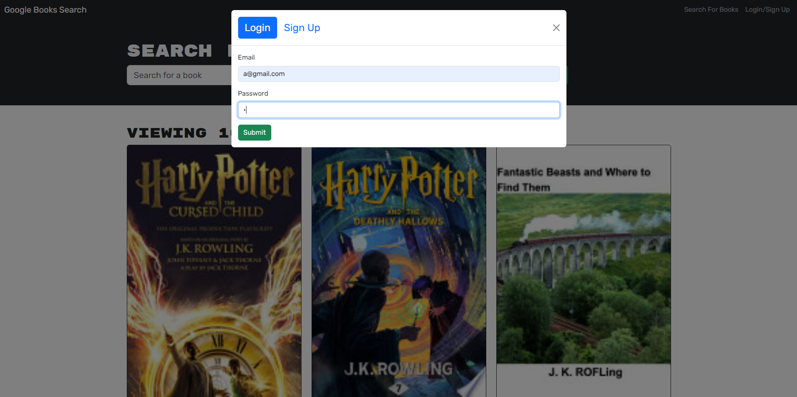
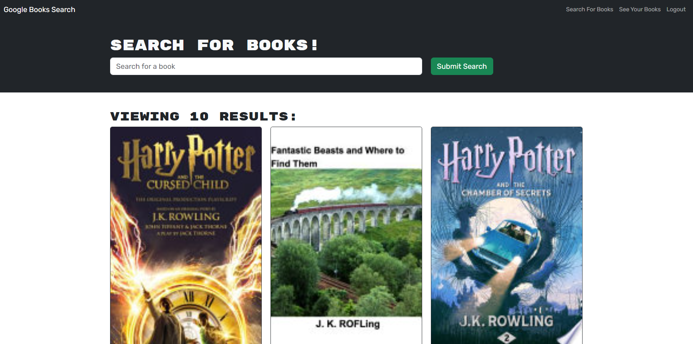
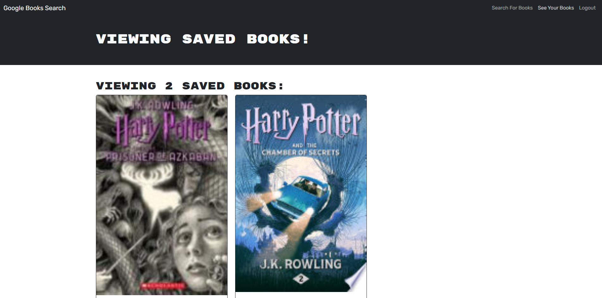
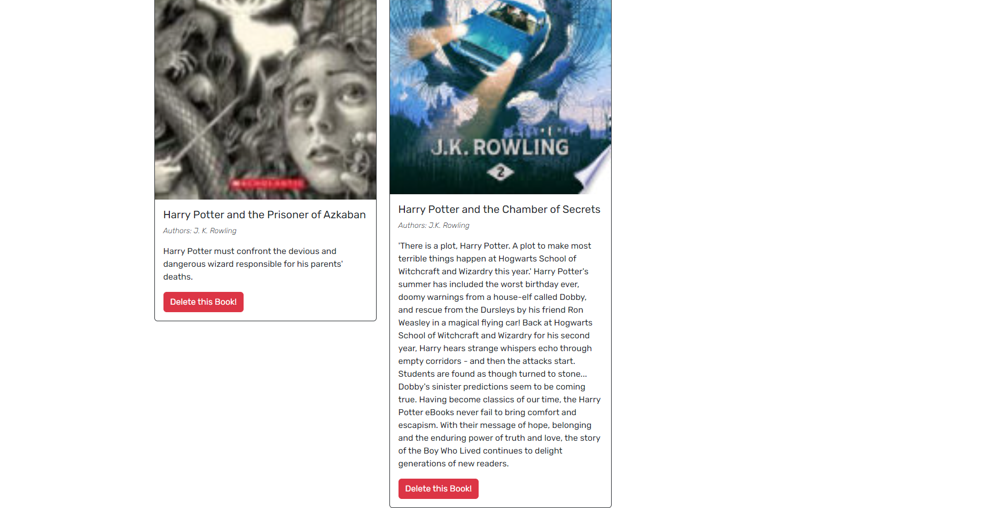

# MERN-Book-Search-Engine

## Description

MERN-Book-Search-Engine is, as its name says, a book search engine. It's perfect for any book lover to search for the books they want to read.  
This application also allows user to save and delete saved books from their list.  
It's built using React, MongoDB, Mongoose, Node.js, Express.js and GraphQL.

## Installation
Before using the application make sure to run "npm i".  
Then run "npm run develop" to start the application.

## Usage
To view and use the MERN-Book-Search-Engine click on the link below.

[MERN-Book-Search-Engine - Sonja Gorin]()

MERN-Book-Search-Engine preview:

## License
Please refer to the LICENSE in the repo.
